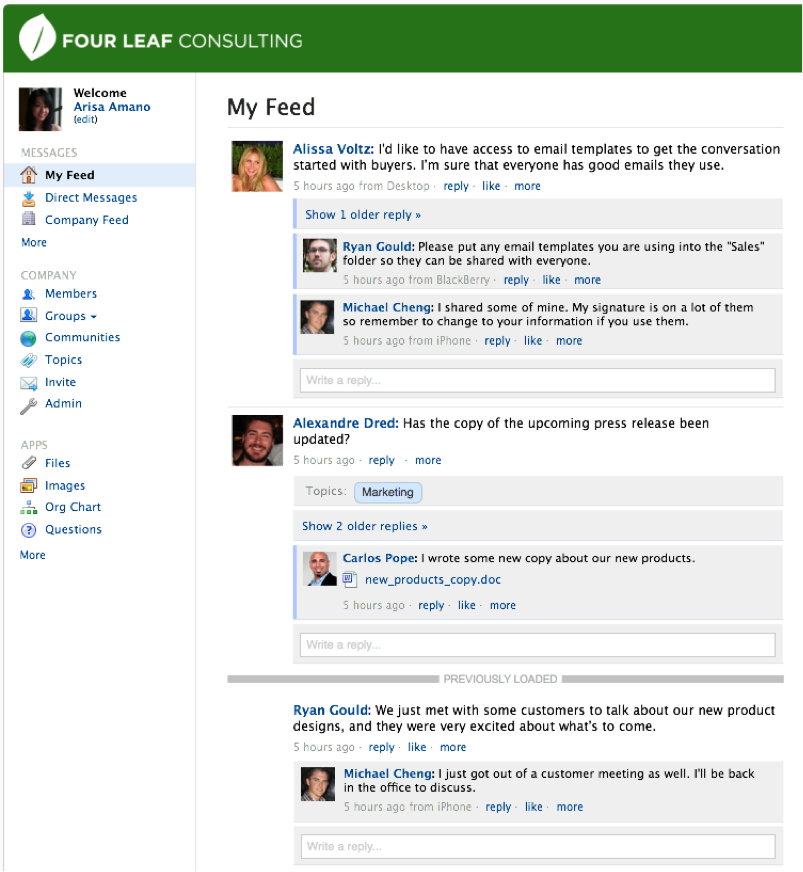

!SLIDE

# Event Feeds #

!SLIDE

# Use Case: Yammer #

!SLIDE center

!SLIDE

## Event Feed Per User ##

!SLIDE smaller

## Event Item ##

    {
      id: 41626118990497,
      timestamp: 1300845012,
      category: "likes-message",
      properties: {
        liker_id: 97238,
        thread_id: 2663589,
        message_id: 2664571
      }
    }

!SLIDE bullets incremental

* IDs with Time Component
* Entries Merged Before Insert
* Sorted and Trimmed
* De-duped

!SLIDE

## Reads Only Parts Using Cursors ##

!SLIDE

## Concern: Conflict Resolution ##

!SLIDE

## Solution: Time-Ordered Entries ##

!SLIDE

## Concern: Exponential Growth ##

!SLIDE

## Solution: Trimming ##

!SLIDE

## Cross-Datacenter Replication ##
